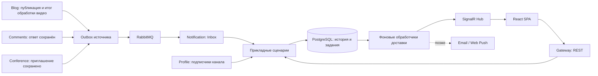

# NotificationService: анализ и предложение по реализации

Дата: 5 сентября 2026 года. Статус: предложение к реализации.

Документ основан на статическом анализе текущего репозитория. Описанные ниже новые проекты, события, таблицы и endpoints — проектируемый контракт, а не уже реализованные возможности. Сервисы и инфраструктура для анализа не запускались; нагрузочные характеристики требуют измерения.

## 1. Рекомендуемое решение

Развивать NotificationService как отдельный микросервис, который принимает факты о действиях из других сервисов, определяет правила уведомления и хранит персональную историю. Источник бизнес-события отвечает за достоверность факта и прав доступа; NotificationService — за создание уведомления, настройки получателя, чтение истории и доставку по каналам.

Начать с InApp: PostgreSQL + EF Core, RabbitMQ и ASP.NET Core SignalR. Использовать существующий `Common/MessageBus`, предварительно устранив перечисленные ниже ограничения надёжности. Email и Web Push подключать через адаптеры после стабилизации InApp. Kafka, отдельный планировщик и замена всей шины для этой задачи не требуются.

Основные гарантии: доставка интеграционных событий как минимум один раз, идемпотентное создание записей, восстановление незавершённой работы после перезапуска. SignalR ускоряет появление уведомлений на экране; сохранённая история доступна через REST независимо от состояния соединения.

## 2. Что есть в репозитории

Все пути в таблице указаны от корня репозитория.

| Область | Подтверждено кодом | Значение для реализации |
|---|---|---|
| Notification API | `NotificationService/Notification.API/Program.cs`: .NET 8, Swagger, Serilog, ServiceDefaults, HTTP-клиент Blog, подписка на `PostUpdateEvent`, маршрут-заглушка `/weatherforecast` | Нет API истории, авторизации, SignalR и регистрации хранилища уведомлений |
| Модель | `NotificationService/Notification.Domain/Entities/UserNotification.cs`: `UserId`, `Payload`, `IsViewed`, типы с `InApp/Push/Email` | Есть начало модели, но нет состояний доставки, дедупликации и настроек пользователя |
| Обработчик | `NotificationService/Notification.Domain/EventHandlers/PostCreateEventHandler.cs` | Для `UpdateType.Create` читает получателей и только логирует их; уведомления не создаёт |
| Старый контракт | `NotificationService/Notification.Contract/Events/CreateNotificationEvent.cs`: `UserId`, `CreatedAt`, строковый `Payload`, exchange `notifications` | Нет стабильного EventId и типизированного содержания; подписчик на этот контракт в Notification API не зарегистрирован |
| Альтернативная рассылка | `BlogService/Blog.Service/Events/Handlers/PostCreatedEventHandler.cs` | Метод начинается с `return`; находящаяся ниже публикация `CreateNotificationEvent` не выполняется |
| Подписки | `ProfileService/Profile.Service/Implementation/DefaultSubscriptionService.cs`, сущность `SubscribedChanel` | Действующие subscribe/unsubscribe находятся в Profile. Изменения и события `SubscriptionChangedV1` записываются вместе через `ReactingEvent` |
| API подписок | `ProfileService/Profile.API/Controllers/SubscriberController.cs` | Есть список каналов пользователя; нужного обратного списка пользователей канала здесь нет |
| Обработка видео | `BlogService/Blog.Service/EventHandlers/VideoProcessSagaHandler.cs`, `VideoReadyToPublishEventHandler.cs` | Результат конвертации проходит через Blog, проверяется актуальность файла, сохраняется итоговое состояние; при успехе создаётся outbox `PostUpdateEvent(Create)` |
| Создание текстового поста | `BlogService/Blog.Service/Services/Implementation/DefaultProfilePostV2Service.cs`, `CreatePostAsync` | Создаётся `PostCatalogChangedV2`, но не `PostUpdateEvent(Create)`. Текущий Notification consumer этот сценарий пропускает |
| Комментарии | `CommentService/Comments.Service/Implementation/DefaultCommentService.cs`, `CreateCommentAsync` | Сохраняется комментарий с `ParentId`; событие ответа не создаётся |
| Конференции | `ConferenceService/Conference.Service/Implementation/DefaultConferenceService.cs`, `Conference.API/Controllers/ConferenceRoomController.cs` | Есть создание комнаты и присоединение участника. Отдельного процесса адресного приглашения в просмотренном контуре нет |
| Надёжность событий | `BlogService/Blog.Service/Services/Implementation/OutboxPublisher.cs`; `RecommendationService/Recommendation.Services/EventHandlers/SubscriptionChangedV1Handler.cs` | Уже есть outbox в Blog и паттерн inbox/`ExecuteOnceAsync` в Recommendation; подход можно повторить без ссылки на их доменные модели |
| Транспорт | `Common/MessageBus/Internal/RabbitMqMessageBus.cs`, `Models/BaseEvent.cs` | Собственная шина, RabbitMQ.Client 7.1.2, ручной ACK, publisher confirms; есть отдельная реализация Kafka, но заготовка уведомлений использует RabbitMQ |
| Хранилища | `Common/Infrastructure/Infrastructure.csproj`, `BlogService/Blog.Persistence/BlogDbContext.cs`, инфраструктурный Compose | EF Core/Npgsql 8.0.11, PostgreSQL, схемы сервисов; также Redis и MinIO |
| Клиентский контур | `GetewayService/Gateway.API/Program.cs`, `nginx/nginx.local-debug.conf`, `frontend/person-blog-app/packages/blog` | Gateway с HTTP-клиентами, Nginx, React/TypeScript, Orval; SignalR уже используется для видео и конференций |
| Запуск | `docker-compose.yml`, `GetewayService/AspireTest/AspireTest.AppHost/AppHost.cs` | NotificationService не подключён к этим схемам запуска; требуется добавить отдельно |

### Проблемы заготовки, которые нельзя переносить дальше

1. **Неверная граница сервиса подписок.** Обработчик обращается к Blog по `api/InternalPost/blogSubscribers/...`; реализация этого endpoint в репозитории не найдена. Нужен новый внутренний API в Profile. Не следует ориентироваться только на названия настроек: в AppHost `AppUrls:Profile` для Gateway указывает на Blog, а `AppUrls:Reacting` — на ProfileService.
2. **Бесконечный цикл на ошибке.** HTTP timeout равен одной секунде; `catch` только пишет ошибку и повторяет ту же страницу без задержки, ограничения попыток и отмены. Consumer остаётся занят и не возвращает результат шине.
3. **Нарушение направления зависимостей.** `Notification.Domain` ссылается на Blog.Contracts и конкретный MessageBus, содержит HTTP-обработчик и атрибуты маппинга БД. Бизнес-модель связана с инфраструктурой.
4. **Неоднозначное событие публикации.** `PostUpdateEvent(Create)` используется после конвертации, не содержит получателя-владельца и видимости поста. Повторная загрузка видео может породить новое `Create`. Нельзя приравнивать его к первой публичной публикации.
5. **Ошибка RabbitMQ не равна надёжной DLQ.** Создаются `error/errors`, но исходным очередям не назначен DLX в коде. На ошибке выполняется ручная публикация в `error` с пустыми `BasicProperties`, без подтверждений consumer-канала; ошибка этой публикации подавляется, затем исходное сообщение получает NACK без requeue. При отсутствии внешней политики DLX возможна потеря. RabbitMQ прямо различает NACK с настроенным DLX и отбрасывание сообщения без него ([документация](https://www.rabbitmq.com/docs/confirms)).
6. **Идентификатор теряется на границе consumer.** Негeneric `BaseEvent` имеет `Id`, но `BaseEvent<T>` и `IMessageContext<T>` не предоставляют EventId; AMQP `MessageId` не выставляется. `CorrelationId` не подходит для дедупликации: одна операция порождает несколько событий.
7. **Ограничения конфигурации шины.** `PrefetchCount` объявлен, но consumer использует константу 10. Регистрация хранится по короткому имени CLR-типа; несколько независимых подписок одного типа внутри процесса не представлены корректно как отдельные маршруты. Это нужно учитывать при расширении общей библиотеки.

## 3. Границы ответственности и поток данных



NotificationService не читает таблицы других микросервисов и не решает, разрешено ли публиковать пост или принимать приглашение. Эти проверки остаются у владельца данных. Внешний REST доступен через Gateway; WebSocket направляется Nginx непосредственно в Notification API по модели уже имеющихся hubs.

## 4. Слои Clean Architecture

Предлагаемая структура:

```text
NotificationService/
  Notification.Domain/
    Entities/                  Notification, NotificationPreference
    ValueObjects/              NotificationKind, NotificationTarget
  Notification.Application/
    Abstractions/              INotificationStore, IRecipientDirectory,
                               INotificationDelivery, ICurrentUser, IClock
    Notifications/             Create, List, MarkRead, CountUnread
    Fanout/                    StartCampaign, ProcessRecipientBatch
    Preferences/               Get, Update
  Notification.Infrastructure/
    Persistence/               NotificationDbContext, Fluent mappings, migrations
    Messaging/                 RabbitMQ consumers и преобразование контрактов
    Clients/                   ProfileRecipientDirectory
    Delivery/                  SignalR adapter; позже Email и WebPush
    BackgroundJobs/            Inbox processor, fanout worker, delivery worker
  Notification.Contract/       HTTP DTO и собственные внешние контракты
  Notification.API/            Controllers, Hub, authentication, Program.cs
Tests/
  NotificationDomainTests/
  NotificationApplicationTests/
  NotificationIntegrationTests/
```

Зависимости компиляции: `Application → Domain`; `Infrastructure → Application, Domain, внешние Contracts`; `API → Application, Infrastructure, Notification.Contract`. API ссылается на инфраструктуру для сборки зависимостей в `Program.cs`. Domain не зависит от остальных проектов; Application не знает RabbitMQ, SignalR, EF Core и домены соседних сервисов. Hub находится в API; адаптер отправки в Infrastructure может использовать собственный пустой тип Hub либо абстракцию, связанную в API, чтобы не создать цикл `Infrastructure → API`.

Перенести `PostCreateEventHandler` из Domain во внешний messaging-адаптер. Адаптер переводит интеграционное событие в прикладную команду; правила получателей, исключение self-notification и выбор каналов находятся в Application/Domain. EF-конфигурации вынести во Fluent API. Время передавать через `IClock`/`TimeProvider`, идентификаторы — явно, чтобы тесты не зависели от статических сервисов.

Названия `Application` и `Infrastructure` предпочтительны для нового сервиса; существующие `*.Service`/`*.Persistence` в монорепозитории не нужно массово переименовывать. Если Persistence выделять отдельно, он также зависит от Application/Domain. Интерфейсы должны описывать операции (`SaveNotification`, `GetRecipientsPage`), а не экспортировать `DbContext` или `IQueryable` в домен. CQRS достаточно реализовать отдельными классами команд и запросов; MediatR и event sourcing для этого не обязательны.

Такое направление зависимостей соответствует описанию Application Core и Infrastructure в [руководстве Microsoft по Clean Architecture](https://learn.microsoft.com/en-us/dotnet/architecture/modern-web-apps-azure/common-web-application-architectures). Конкретные имена проектов и степень разделения — решение этого проекта, а не требование фреймворка.

## 5. Сценарии и интеграционные события

Предлагаемые новые события:

| Событие | Источник и момент записи в outbox | Получатель | Содержимое сверх общей метаинформации |
|---|---|---|---|
| `VideoProcessingCompletedV1` | Blog: актуальный файл успешно переведён в Complete | Пользователь, загрузивший видео; если инициатор не хранится — явно выбранный владелец блога | `PostId`, `BlogId`, `RecipientUserId`, `VideoMetadataId`, `ProcessingAttemptId` |
| `VideoProcessingFailedV1` | Blog: актуальная попытка завершилась ошибкой | Тот же пользователь | Те же идентификаторы, безопасный `ErrorCode` |
| `PostPublishedV1` | Blog: первая доступная аудитории публикация | Подписчики канала | `PostId`, `BlogId`, `AuthorUserId`, `PublicationId`, `PublishedAt`, `Title`, `Audience` |
| `CommentReplyCreatedV1` | Comments: ответ и outbox сохранены одной транзакцией | Автор родительского комментария | `CommentId`, `ParentCommentId`, `PostId`, `ActorUserId`, `RecipientUserId` |
| `ConferenceInvitationCreatedV1` | Conference: создано адресное приглашение | Приглашённый пользователь | `InvitationId`, `ConferenceId`, `ActorUserId`, `RecipientUserId`, `ExpiresAt` |

### Семантика сценариев

- **Видео:** событие выпускает Blog после принятия результата обработки, а не FFmpeg worker сразу после конвертации. Использовать существующую проверку актуальности `VideoMetadataId`. Повторная обработка той же попытки не создаёт второй результат. Новая попытка имеет новый идентификатор. Процент прогресса остаётся в существующем видеохабе, а не превращается в множество записей истории.
- **Публикация:** в Blog ввести единое правило `CanNotifyAudience`: обработка завершена, пост не удалён/не заблокирован и доступен выбранной аудитории. Текстовый пост проверять при создании; видео — после обработки; переход из private в public — при изменении видимости. В MVP рассылать только публичные посты. Добавить сохраняемый `PublicationId`/маркер первой публикации: изменение заголовка или замена видео не запускает рассылку повторно. Для осознанной повторной публикации впоследствии определить отдельную команду и новую идентичность публикации.
- **Ответ:** Comments сам читает автора родительского комментария, проверяет принадлежность тому же `PostId`, допустимость ответа удалённому комментарию и сохраняет факт. Сейчас проверяется только существование `ReplyTo`; межпостовую ссылку необходимо исключить. В Notification исключить `ActorUserId == RecipientUserId`. Уведомлять автора непосредственного родителя, не всех участников ветки.
- **Конференция:** сначала реализовать `ConferenceInvitation` с Pending/Accepted/Declined/Expired/Revoked, сроком и адресатом. Создание приглашения требует права приглашать. Notification хранит ссылку на приглашение, но не добавляет участника. Принятие выполняется в Conference с повторной проверкой адресата, срока и активности комнаты; текущий join не является событием приглашения.
- **Другие действия:** добавляются контракт владельца факта, mapping и политика уведомления; способы доставки переиспользуются. Не создавать универсальный публичный endpoint «отправить произвольный Payload произвольному UserId».

### Контракты и версионирование

Минимальная метаинформация каждого нового события: `EventId`, `OccurredAt` (UTC), `SchemaVersion`, `Producer`, необязательные `CorrelationId` и `CausationId`. Для изменения состояния добавить `AggregateId`/`AggregateVersion`, когда требуется порядок. EventId генерируется при сохранении бизнес-транзакции и остаётся тем же при повторной публикации.

Пример нового контракта, без зависимости от транспорта:

```csharp
public sealed record CommentReplyCreatedV1(
    Guid EventId,
    DateTimeOffset OccurredAt,
    Guid CommentId,
    Guid ParentCommentId,
    Guid PostId,
    Guid ActorUserId,
    Guid RecipientUserId);
```

На первом этапе `EventId` можно включить в payload новых контрактов: это совместимо с нынешним `BaseEvent<T>`. Затем расширить envelope и `IMessageContext<T>` метаданными, выставлять AMQP MessageId; если идентификатор присутствует в двух местах, проверять их совпадение. Поддерживать старые сообщения во время перехода, но не генерировать новый случайный EventId при каждом повторном получении старого сообщения.

Контракты фактов принадлежат источникам: Blog.Contracts, новым Comments.Contracts и Conference.Contracts. Новые contracts-проекты не должны ссылаться на Domain, EF или MessageBus; маршрутизацию задавать регистрацией во внешнем слое. Существующий Blog.Contracts уже связан с доменом — разрешается временный адаптер на границе, но не перенос этой зависимости в Notification.Domain/Application.

`SubscriptionChangedV1` сейчас находится в Recommendation.Contracts, хотя публикуется Profile. Для будущей проекции подписок перенести владение контрактом в Profile.Contracts через совместимую миграцию producer/consumers; не менять wire-name и маршруты без переходного периода. Старый `CreateNotificationEvent` вывести из эксплуатации после проверки всех ссылок. Он описывает команду уведомить, а не бизнес-факт; применять такой подход можно отдельно для административных рассылок с явно ограниченными правами.

## 6. Сохранение и гарантии обработки

### Рекомендуемый алгоритм

1. Источник сохраняет бизнес-изменение и outbox в **одной локальной транзакции EF Core**. Нельзя сначала сохранить комментарий, а затем отдельно отправить событие в RabbitMQ.
2. Outbox dispatcher публикует persistent-сообщение и после подтверждения брокера отмечает его отправленным. При неопределённом результате повторяет тот же EventId. Текущий Blog OutboxPublisher можно развить: добавить `NextAttemptAt`, lease/claim, наблюдаемость исчерпания попыток. Он сейчас выбирает 100 записей без захвата на экземпляр и сохраняет состояние после publish, поэтому дубли при сбое ожидаемы.
3. Notification consumer валидирует сообщение и сохраняет в Inbox полный payload с уникальным ключом `(Producer, EventId, ConsumerName)`. После commit возвращается из handler, после чего шина отправляет ACK. Повтор уже сохранённого сообщения безопасно подтверждается.
4. Inbox worker захватывает задание с lease и обрабатывает его. Для одного адресата в одной транзакции создаёт Notification, DeliveryJob и отмечает Inbox обработанным. Для массового события в той же транзакции создаёт FanoutCampaign и завершает Inbox: продолжение уже принадлежит сохранённой кампании.
5. Fanout worker последовательно сохраняет страницы получателей, уведомления, задания доставки и cursor; delivery worker отправляет уже зафиксированные записи по каналам. Сетевые вызовы не удерживают транзакции БД.

Такой durable inbox позволяет быстро освободить RabbitMQ consumer и повторять бизнес-обработку независимо от транспорта. Если БД недоступна до commit Inbox, нельзя ACK или выбросить сообщение через текущий путь потери ошибок: consumer должен остановить потребление/возобновить с backoff либо использовать проверенную схему повторов брокера.

Publisher confirms подтверждают приём брокером, а consumer ACK — завершение обработки на стороне получателя. Возможные повторные передачи требуют идемпотентности ([RabbitMQ Reliability Guide](https://www.rabbitmq.com/docs/reliability)). Гарантию exactly-once для внешних каналов не заявлять.

### Минимальные изменения Common/MessageBus

- Сохранить уже реализованные publisher confirms и `mandatory`; проверить обработку unroutable publish интеграционным тестом. Объявлять exchanges, очереди и bindings до включения новых producers: один durable exchange без очереди историю событий не хранит.
- Добавить EventId и CancellationToken в доступные handler метаданные, не ломая существующих потребителей.
- Заменить небезопасный `PublishErrorAsync` на надёжный маршрут: transient-ошибки до Inbox — ограниченные повторы с backoff; невалидные сообщения — карантин с сохранением исходного тела и причины. Подтверждать оригинал только после подтверждённой передачи в durable карантин/повторную очередь либо durable сохранения ошибки. Возможные дубли этой передачи должны быть безопасны.
- Для broker DLX явно настроить политики и проверить гарантии выбранного типа очередей. Не считать наличие `error/errors` готовой реализацией retry/DLQ. Не делать бесконечный `requeue:true` без паузы.
- Для новых типов использовать уникальные версионированные имена, явные очереди вроде `notification.comment-reply.v1`. Существующий `post-update` типа fanout не переобъявлять как topic; новую топологию создавать под новыми именами.
- Настраивать prefetch и число consumer-потоков. Изменения общей библиотеки проверять на Blog/Profile/Recommendation, включая текущую регистрацию нескольких handlers одного типа.

На старте настраиваемые повторы фоновых заданий: например, 5 с, 30 с, 2 мин, 10 мин, затем более редкие попытки до заданного лимита с jitter. После лимита — Failed и ручной replay с теми же идентификаторами. Это начальные параметры для проверки нагрузкой, не измеренный SLA.

## 7. Модель данных Notification

Использовать собственный `NotificationDbContext`, миграции и схему `Notification` в текущем PostgreSQL. Отдельные права доступа к схеме обязательны для сохранения границы сервиса; отдельная физическая БД может появиться позднее. Межсервисных FK и SQL JOIN не добавлять.

| Таблица | Основные данные и ограничения |
|---|---|
| Notifications | `Id`, `UserId`, `Kind`, `SourceProducer`, `SourceEventId`, `BusinessKey`, `ActorUserId?`, `TargetType`, `TargetId`, `TemplateKey`, `TemplateVersion`, `Data jsonb`, `OccurredAt`, `CreatedAt`, `ReadAt?`, `ExpiresAt?` |
| InboxMessages | Producer/EventId/ConsumerName — unique; EventType, SchemaVersion, Payload, ReceivedAt, State, Attempts, NextAttemptAt, LockedUntil, LastError |
| FanoutCampaigns | `Id`, SourceEventId, PublicationId, BlogId, AudienceCutoff, Cursor, State, Attempts, NextAttemptAt, lease; unique по PublicationId и назначению кампании |
| DeliveryJobs | NotificationId, Channel, DestinationKey, State, Attempts, NextAttemptAt, lease, LastError, ProviderMessageId; unique по NotificationId/Channel/DestinationKey |
| NotificationPreferences | UserId/Kind/Channel — unique; Enabled, UpdatedAt; позже настройки отдельных каналов-блогов и тихих часов |
| PushSubscriptions, позднее | UserId, DeviceId, Endpoint, ключи подписки, статус и время обновления; секреты защищать, не писать в логи |

`Kind` означает бизнес-причину (`post.published`, `comment.reply`), `Channel` — способ доставки. Заменить смешанную модель `NotificationType`/`UserNotificationTypes` этим разделением. `ReadAt` относится к пользовательскому прочтению, а не к успешному вызову SignalR или Email API.

Уникальность Notifications: `(UserId, Kind, BusinessKey)`. Примеры BusinessKey: PublicationId для публикации, CommentId для ответа, InvitationId для приглашения, ProcessingAttemptId для результата обработки. Стабильный бизнес-ключ защищает даже от двух ошибочно выпущенных событий с разными EventId. Конфликт вставки должен означать «уже создано», а не повторную отправку; использовать уникальный индекс и корректный upsert/rollback, а не только предварительный SELECT.

Индексы: `(UserId, CreatedAt DESC, Id DESC)` для ленты; частичный индекс непрочитанных `WHERE ReadAt IS NULL`; `(State, NextAttemptAt)` для фоновых заданий. Захват задач — короткая транзакция с `FOR UPDATE SKIP LOCKED` либо атомарный lease update; завершение проверяет lease token, чтобы старый worker не перезаписал результат нового. При большом объёме ограничивать пачки и применять bulk insert/upsert.

Payload хранить как небольшой версионированный набор данных для шаблона, а не произвольный HTML. Не включать сырые FFmpeg-ошибки, MinIO credentials, полные тексты закрытых постов и токены приглашений. Навигация строится по типу ресурса и идентификаторам из разрешённого набора маршрутов. Текст из пользовательских полей экранируется.

## 8. Массовая рассылка подписчикам

### MVP: чтение страниц из Profile

Добавить внутренний endpoint в **ProfileService**, например `GET /api/internal/blogs/{blogId}/subscribers?cursor=...&limit=500&cutoff=...`, защищённый сервисной аутентификацией. Контракт ответа: `userIds`, `nextCursor`, `hasMore`. Это новый API; существующий `/api/Subscriber/subscriptions` возвращает другую сторону отношения.

Использовать keyset pagination по неизменяемой паре `(CreatedAt, UserId)` и соответствующий индекс `(BlogId, CreatedAt, UserId)`. Cursor формирует Profile; Notification хранит и передаёт его непрозрачно. Offset/номер страницы при конкурентной отписке может пропустить пользователей. Повтор запроса одной страницы должен быть безопасен, а порядок сортировки — явным.

1. После `PostPublishedV1` создать кампанию с PublicationId и верхней временной границей аудитории.
2. Worker читает ограниченную страницу вне транзакции БД; timeout, backoff и circuit breaker задаются отдельно от срока жизни сообщения RabbitMQ.
3. Исключить автора и отключивших этот вид уведомлений. Вставить уведомления и DeliveryJobs идемпотентно; cursor и результаты пачки сохранить одной транзакцией.
4. При сбое повторить текущую страницу. При завершении `hasMore=false` пометить кампанию Completed.
5. Ограничить параллелизм и дать личным ответам/приглашениям отдельный бюджет worker-потоков, чтобы большая рассылка не задерживала их.

**Семантика аудитории MVP:** пользователи с активной подпиской на момент чтения их страницы, созданной не позже PublishedAt. Это не строгий снимок «все подписчики в момент публикации»: Profile физически удаляет подписку, а отписка/повторная подписка во время обхода меняет состав. Ограничение явно принять для MVP; cutoff не решает его полностью. Повторная проверка перед внешней отправкой уменьшает число уведомлений после отписки, но гонку с самой отправкой полностью не устраняет.

Если нужен точный снимок, Profile должен хранить историю интервалов подписки либо материализовать аудиторию кампании у себя и выдавать стабильные страницы по SnapshotId. Нельзя обещать точную историческую аудиторию по текущей таблице активных подписок.

### При росте нагрузки: локальная проекция

Notification может поддерживать собственную read-модель подписок через события Profile. Но текущего `SubscriptionChangedV1` недостаточно для надёжного порядка unsubscribe/resubscribe: нужны монотонная версия отношения и tombstone последней отписки. Также нужны начальный snapshot с watermark, воспроизведение изменений после watermark и процедура сверки. Даже такая проекция не гарантирует точную аудиторию на момент события из другого сервиса без согласованного правила времени/водяного знака. Поэтому для начала внутренний API проще и честнее по гарантиям.

## 9. API, SignalR и frontend

Предлагаемый внутренний REST API Notification; публичный Gateway предоставляет те же операции под существующим префиксом `/video/api/notifications`:

| Метод и путь | Поведение |
|---|---|
| `GET /api/notifications?cursor=...&limit=...&unreadOnly=...` | Лента текущего пользователя; cursor по CreatedAt/Id, ограничение limit |
| `GET /api/notifications/unread-count` | Число непрочитанных |
| `PUT /api/notifications/{id}/read` | Идемпотентно установить ReadAt только у своего уведомления |
| `PUT /api/notifications/read-all` | Пометить прочитанными записи до переданной серверной границы снимка, чтобы не захватить новые поступления |
| `GET/PUT /api/notification-preferences` | Чтение/обновление собственных настроек |

UserId берётся из проверенной сессии, не из параметра запроса. Каждый запрос к Notification дополнительно фильтрует данные по UserId, даже если Gateway уже авторизовал вызов. Для чужого/несуществующего id возвращать одинаковый ответ 404. Фоновые процессы используют отдельные сервисные credentials, не пользовательский JWT из события.

В Notification API подключить существующие authentication/session компоненты и authorization, адаптируя `ICurrentUserService` к Application-интерфейсу. Проверить подпись, issuer/audience, lifetime, тип access token и валидность сессии; не использовать простое декодирование `GetTokenModel` как доказательство подлинности. Текущая заготовка этого контура не имеет.

Hub `/hubs/notifications` требует авторизации. Отправка через `Clients.User(userId)`; `IUserIdProvider` читает проверенный `AppClaimTypes.UserId`, который уже использует генератор JWT проекта. Нельзя использовать session Id/BlogId вместо UserId или позволять клиенту выбирать чужую группу. Для browser WebSocket/SSE использовать `accessTokenFactory`, а query-параметр `access_token` принимать только на пути этого hub и исключить из логирования. См. [SignalR authentication](https://learn.microsoft.com/en-gb/aspnet/core/signalr/authn-and-authz?view=aspnetcore-8.0).

Передаваемое событие: `NotificationCreated` с `notificationId` и минимальным DTO либо сигналом обновления; дополнительно `NotificationsRead` для синхронизации вкладок. Успешный SendAsync — факт попытки realtime-доставки, не прочтение и не доказательство получения браузером. Отсутствие клиента не требует бесконечного retry: история уже сохранена. Истечение/отзыв сессии должно закрывать соединение по выбранной политике; после refresh клиент переподключается.

Frontend: единый connection provider на сессию, колокольчик со счётчиком, список с cursor pagination, отметка прочтения, настройки. Подключить hub, загрузить REST-снимок и объединить события по NotificationId, чтобы не потерять поступление между подключением и загрузкой. После reconnect/возврата на вкладку перечитать первую страницу и count; для гарантированного incremental sync позднее нужен отдельный серверный sequence/change cursor. Cursor сортировки ленты не является гарантированным журналом порядка commit. Дубликаты SignalR не увеличивают счётчик повторно; счётчик периодически сверяется с REST. Обновить OpenAPI и генерировать Orval-клиент, не править generated вручную.

Для MVP — один экземпляр API/worker. Для нескольких экземпляров с локальными SignalR connections подключить Redis backplane с отдельным channel prefix и sticky sessions на балансировщике. Redis не восстанавливает пропущенные realtime-сообщения, поэтому REST остаётся путём восстановления ([Microsoft: Redis backplane](https://learn.microsoft.com/en-us/aspnet/core/signalr/redis-backplane?view=aspnetcore-10.0)). При выделении worker в отдельный процесс его адаптер должен отправлять через общий backplane или надёжный маршрут к API; простой локальный HubContext отдельного процесса не найдёт клиентов API.

## 10. Каналы, настройки и жизненный цикл

В MVP InApp включён для четырёх базовых сценариев; пользователь может отключить выбранный Kind. Правила приоритетов: явная настройка пользователя → настройка конкретного канала-блога, если введена → системное значение по умолчанию; точный порядок глобальной и локальной настройки закрепить в одном resolver. При глобальном запрете канала локальное разрешение не должно его обходить.

Email/Web Push требуют отдельных подтверждённых контактов/подписок и адаптеров `INotificationDelivery`. Notification управляет предпочтениями, Auth остаётся владельцем подтверждения email; получать изменение подтверждённого контакта через защищённый контракт, не копировать всю таблицу пользователей. Push требует разрешения браузера, service worker и поддержки нескольких устройств. Для каждого устройства создаётся отдельное задание с DestinationKey; невалидные endpoints отключаются.

Email/Push имеют собственные Attempts/NextAttemptAt и не блокируют InApp. Для провайдера с idempotency key передавать стабильный DeliveryJobId. При timeout после успешной внешней отправки повтор без поддержки идемпотентности провайдером может дать дубль — это явное ограничение. Перед попыткой проверять актуальное разрешение канала и истечение срока. Поздние уведомления о приглашении не отправлять после ExpiresAt; при открытии ранее созданного приглашения актуальный статус проверяет Conference.

Удаление/закрытие ресурса не означает автоматическое удаление всей истории: показывать нейтральный недоступный target. Для приватных/платных публикаций расширение требует отдельного согласования аудитории и безопасного текста; изменение доступа после отправки не может отозвать уже прочитанное письмо. В MVP не включать чувствительные сведения в уведомления.

Сроки хранения задавать конфигурацией и продуктовыми требованиями: например, история 90 дней как начальное предложение. Inbox/dedup и бизнес-маркеры должны жить не меньше максимального окна redelivery/replay; при удалении старых Notifications сохранять компактные dedup tombstones либо запрещать replay за retention-границей. Иначе поздний replay воссоздаст уведомления. При удалении аккаунта удалять настройки/контакты/историю, отменять задания и блокировать повторное создание по запоздавшим событиям.

## 11. Наблюдаемость и эксплуатация

Использовать уже подключённые Serilog, OpenTelemetry и ServiceDefaults/Seq. Логировать EventId, CorrelationId, Kind, CampaignId, NotificationId, этап и попытку; не писать полный payload, адреса и токены. UserId и EventId не использовать как labels метрик из-за высокой кардинальности.

Минимальные метрики: возраст старейшего outbox/inbox/job, длина очереди, число created/deduplicated/failed, latency от OccurredAt до сохранения, длительность и прогресс кампании, HTTP-ошибки Profile, ошибки SignalR/провайдеров. Раздельно измерять принятие события, создание истории и попытку внешней доставки.

Liveness проверяет живость процесса, readiness — зависимости соответствующей роли. Падение Redis не должно лишать REST доступа к истории; падение Profile задерживает только кампании подписчиков. Настроить алерты на растущий backlog и failed jobs, административный просмотр и replay карантина с авторизацией и аудитом.

Notification.API, Domain и Contract уже включены в solution; добавить туда новые Application/Infrastructure и тестовые проекты. Подключить Notification API к AppHost и Compose; добавить Dockerfile, конфигурации PostgreSQL/RabbitMQ/Profile/Auth, Nginx hub route, Gateway client и Swagger. Передать секреты штатным способом окружения. Отдельно проверить URL BaseAddress и `/api/`, учитывая исторические имена Profile/Reacting. Миграции применять управляемо до запуска новых consumers.

## 12. Поэтапный план и критерии готовности

| Этап | Изменения | Проверяемый результат |
|---|---|---|
| 1. Основа и надёжность | Application/Infrastructure, DbContext, Inbox/DeliveryJobs, unique keys; безопасные ошибки шины; явная топология | Повтор EventId и сбой до/после ACK не теряют факт и не создают дубль |
| 2. Вертикальный срез видео | Новые события результата в транзакции Blog, REST, auth, SignalR, Gateway/Nginx, колокольчик | Офлайн-пользователь видит результат при входе; онлайн получает обновление; старая загрузка не уведомляет об успехе новой |
| 3. Ответы | Comments.Contracts, parent-проверки, outbox и consumer | Один ответ — одно уведомление автору родителя, self-reply исключён |
| 4. Публикации | Единое правило публикации для текста/видео, PublicationId, Profile recipient API, FanoutCampaign | Только первая публичная публикация запускает рассылку; restart посередине пачки безопасен |
| 5. Приглашения | Домен приглашений и endpoints Conference, outbox, consumer | Уведомление не присоединяет автоматически; адресат/срок/отзыв проверяются при принятии |
| 6. Расширение | Preferences UI, Email/Web Push, несколько экземпляров, backplane, нагрузочная оптимизация | Каналы независимы; отключение/истечение соблюдаются; показатели соответствуют согласованной нагрузке |

Не включать старую и новую рассылку одновременно без общей дедупликации. Развёртывание: migrations → queues/bindings → consumers → producers → UI. Старые events оставить для их текущих потребителей; Notification переключать на новые факты постепенно. Исторические посты не рассылать автоматически при миграции: заполнить маркеры уже опубликованных записей без создания PostPublishedV1, а догрузку истории обсуждать отдельно.

### Проверки до включения пользователям

- Unit: правила Kind/Channel, self-notification, read idempotency, expiry и mapping контрактов.
- Архитектурная проверка ссылок: Domain/Application не тянут EF/RabbitMQ/SignalR и чужие Domain-проекты.
- Интеграционные тесты с реальными PostgreSQL и RabbitMQ: rollback бизнес-изменения вместе с outbox; повтор после publish до сохранения sent; commit Inbox до ACK; параллельная вставка одного BusinessKey; недоступность БД; невалидный JSON; unroutable event; подтверждённый карантин и replay.
- Fanout: несколько страниц, отписка между страницами с оговорённой семантикой MVP, crash до/после commit пачки, два worker на одной кампании, истечение lease, отсутствие Profile.
- Безопасность: чужая история/read возвращают отказ, неверный/отозванный/refresh token не открывает hub, пользователь не выбирает чужой UserId; приватный пост не рассылается.
- E2E: текстовый пост и видео, ответ, приглашение; пользователь офлайн, reconnect, две вкладки, refresh token, повтор одного SignalR события.
- Нагрузка: большой канал параллельно с личными ответами; измерить задержки, память, размер БД и влияние на Profile. Порог числа подписчиков и требуемую задержку определить до выбора числа workers.

## 13. Решения, которые требуют продуктового уточнения

Реализацию основы можно начинать с предложенными MVP-правилами. До включения соответствующего сценария закрепить: кому адресовать результат видео при нескольких редакторах блога; считать ли повторную публикацию новым поводом; нужна ли точная аудитория на момент публикации; поддерживать ли платные/закрытые посты; кто вправе приглашать в конференцию; сроки хранения и требуемые задержки. В этом предложении по умолчанию выбран владелец при отсутствии сохранённого инициатора, первая публичная публикация, активные подписчики при чтении страницы и доставка InApp.
